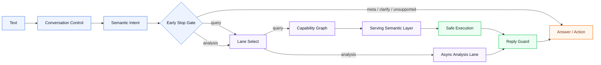

# Hetang Ops

> Sync business facts locally. Understand business questions. Answer and act through controlled paths.

Hetang Ops is the local operating kernel for Hetang stores.

In simple terms, it does four things:

1. Pull business facts from upstream systems
2. Store them in local PostgreSQL as the source of truth
3. Understand natural-language business questions
4. Return answers, reports, and action suggestions through safe, auditable paths

It is not just a report generator, and it is not a generic chatbot.
Its job is to turn store data into a controllable operating system for HQ, store managers, and customer-growth workflows.

The core idea is:

`Deterministic business truth + semantic routing + bounded AI agents + execution feedback loop`

## Project Thesis

The long-term direction of this repo is:

1. `Build a local business-truth kernel`
   Every serious operating judgment should rest on local facts, not on a remote model's guess.
2. `Put a semantic operating system on top of it`
   Natural-language inputs should be recognized as intent, routed as capabilities, and executed through safe owner paths.
3. `Use bounded AI agents where cognition matters`
   AI should do semantic interpretation, capability choice, async diagnosis, weak-signal explanation, and learning-loop optimization.
4. `Close the loop back into execution`
   The system should not stop at "answer generation". It should support action selection, delivery, review, and future correction.

## Architecture



<table>
  <tr>
    <td width="25%">
      <strong>Front Door</strong><br/>
      Text -> Conversation Control -> Semantic Intent -> Early Stop Gate
      <br/><br/>
      Cheap checks, clarification, noop handling, and direct meta replies should end here whenever possible.
    </td>
    <td width="25%">
      <strong>Routing Brain</strong><br/>
      Lane Select -> Capability Graph
      <br/><br/>
      Query, analysis, and capability ownership are chosen explicitly instead of being scattered across ad-hoc branches.
    </td>
    <td width="25%">
      <strong>Truth Layer</strong><br/>
      Serving Semantic Layer -> Safe Execution
      <br/><br/>
      Business answers come from structured serving reads and safe execution paths, not free-form generation.
    </td>
    <td width="25%">
      <strong>Delivery Layer</strong><br/>
      Reply Guard -> Answer / Action
      <br/><br/>
      Final output is checked for store mismatch, unsupported claims, template leakage, and other trust-breaking errors.
    </td>
  </tr>
</table>

## Design Principles

- `Query` remains deterministic, auditable, and permission-safe.
- `Analysis` can be richer, but it must stay bounded and fact-first.
- `Capability Graph` is the canonical routing surface for new query and report work.
- `Reply Guard` is the last trust barrier, not the main router.
- `AI` is a decision-layer amplifier, not the source of business truth.

## AI-Native Direction

htops is not trying to be a free-form chatbot bolted onto reports. The intended direction is an AI-native operating intelligence stack with three stable layers:

1. `Deterministic core`
   Raw ingestion, normalization, PostgreSQL facts, serving views, schedule control, report readiness, and delivery state remain the hard-truth layer.
2. `Bounded AI harness`
   Semantic front door, capability routing, lane selection, async analysis, and quality review let AI participate only through explicit, observable paths.
3. `Business output surfaces`
   Reports, HQ summaries, customer-growth actions, query answers, and weak-signal explanations are treated as outputs of the operating kernel, not the kernel itself.

This is why the project uses an Ontos-lite shape instead of a heavy ontology runtime:

`Text -> Semantic Intent -> Capability Graph -> Serving Semantic Layer -> Safe Execution -> Answer / Action`

The system has a semantic skeleton, but truth still lands in the local fact layer and deterministic execution path. In other words: the repo is AI-native in interaction and cognition, but fact-native in truth and execution.

### Current AI Footprint

AI is already used in four meaningful places:

1. `Semantic Intent`
   Natural-language inputs are classified into bounded lanes such as `meta`, `query`, and `analysis`, instead of sending every message to one general model.
2. `Capability Graph`
   Query and runtime-render abilities are selected through an explicit capability graph rather than ad-hoc branching.
3. `Async Analysis Lane`
   Heavier reasoning runs out of band in the analysis worker, which keeps the primary execution path fast and deterministic.
4. `Semantic Quality Loop`
   Failures, review findings, lane observability, and semantic audits create a feedback loop for improving prompts, routing, and capability coverage over time.

### What Makes It AI-Native

The repo should be thought of as AI-native because:

1. It has a `semantic front door`
   Inputs are not treated as plain commands. They are interpreted as intent.
2. It has a `capability router`
   Work is dispatched through a capability graph rather than one undifferentiated model call.
3. It has `bounded agents`
   Async analysis and review paths already behave like constrained agents with clear execution roles.
4. It has a `learning loop`
   Semantic quality, review, and route drift are first-class signals for improving system behavior.
5. It has a `truth boundary`
   AI can think, explain, compare, and prioritize, but cannot silently overwrite business fact.

### AI Framework Shape

The project's AI flavor is best understood through three terms:

1. `Bounded AI Harness`
   AI is orchestrated through explicit workers, timeouts, fallbacks, and owner modules. It does not directly own truth.
2. `Ontos-lite`
   The repo keeps a minimal semantic structure through semantic intent, capability graph, serving semantics, semantic state, and execution audit without introducing a second ontology runtime.
3. `Bounded AI Agent`
   Agents here are not global autonomous operators. They are constrained role-players that do question understanding, capability selection, async diagnosis, weak-signal explanation, and quality review.

### Data vs Knowledge Boundary

This repo does support knowledge-driven answers, but it does **not** treat all operating data as a knowledge base.

The architecture boundary is:

- structured business facts stay in PostgreSQL / serving queries / metric semantics
- rules, SOPs, policy, training, and metric definitions belong in the knowledge layer
- the model/agent layer interprets the question, chooses tools, combines query results with retrieved knowledge, and produces the final explanation

In short:

`database + metric semantic layer + knowledge base + bounded agent + permission audit`

This is the intended operating-intelligence stack for htops, not a pure vector-RAG chatbot.

See also:

- `docs/adr/2026-04-29-structured-data-knowledge-base-agent-boundary.md`

### Target Form

The target form is not "AI writes store reports". The target form is:

- `Semantic Operating System` for store and HQ intent
- `Capability-driven execution graph` for bounded action and answer paths
- `Async cognitive layer` for heavier diagnosis and synthesis
- `Quality loop` that continuously upgrades prompts, routes, and capability coverage
- `Execution feedback loop` that grounds future AI behavior in real outcomes

## Raising AI Usage And Efficiency

The highest-leverage way to increase AI usage is not to spray models across the codebase. It is to deepen AI where it compounds:

1. `Make the semantic front door stronger`
   Improve semantic intent recognition, multi-turn slot inheritance, and conversation semantic state so AI can understand what the user is actually trying to do before execution starts.
2. `Expand the Capability Graph`
   Add more HQ, customer-growth, action-execution, and industry-context capabilities so AI selects better operating paths instead of producing generic language.
3. `Increase AI density in the analysis worker`
   Put richer diagnosis, explanation, and strategy synthesis into the async analysis lane where latency is acceptable and deterministic truth can still be injected as evidence.
4. `Strengthen the semantic quality loop`
   Turn failures, mismatches, and low-confidence outputs into sample-driven routing, prompt, and capability upgrades instead of manual guesswork.
5. `Keep AI lanes specialized`
   Use separate lanes for cheap summaries, semantic fallback, customer-growth JSON work, premium analysis, and offline review so usage can go up without destroying latency or cost.

### Efficiency Rules

AI usage should increase under these rules:

1. `Do not move AI into raw fact ingestion`
   `src/client.ts`, `src/normalize.ts`, `src/sync.ts`, and the fact-writing path should remain deterministic.
2. `Use AI where interpretation matters`
   Semantic intent, capability selection, analysis synthesis, weak-signal explanation, and quality review are the right places.
3. `Prefer async analysis for heavy thinking`
   Richer business diagnosis should accumulate in the analysis worker, not in the latency-sensitive main query path.
4. `Treat AI as an optimizer of decision surfaces`
   The goal is not more model calls. The goal is better HQ and store-level operating judgment with lower noise and higher trust.

### Near-Term AI-Native Path

The practical path to a more AI-native system is:

1. `P0`
   Strengthen `Semantic Intent` and conversation semantic state so multi-turn operating asks stop falling back to shallow routing.
2. `P1`
   Expand the `Capability Graph` to cover more HQ decision surfaces, customer-growth actions, and bounded industry-context reads.
3. `P2`
   Turn the analysis worker and semantic quality loop into a real learning system where failures, review outcomes, and action results improve future AI execution.

Expanded roadmap:

- `docs/plans/2026-04-29-ai-native-enhancement-roadmap.md`

## Project Boundary

- This repository root is the business project root where Hetang code, config, scripts, and runtime state should keep evolving.
- OpenClaw is now an optional gateway adapter only.
- OpenClaw-specific compatibility files live under `adapters/openclaw/`.
- If another gateway repo needs this adapter, point that integration at `adapters/openclaw/`, not at the whole project root.

## Internal Architecture Notes

- `src/access/` owns machine-readable access context construction and quota/scope decisions.
- `src/capability-graph.ts` owns the Capability Graph source of truth for serving-query abilities, runtime-render narrative abilities, and the first async-analysis abilities, including fallback links and downstream links.
- `src/capability-registry.ts` is now a compatibility facade over the graph, so new query capability work should extend the graph first.
- `src/runtime/` owns the thin runtime shell for serving-query execution and doctor delegation.
- `src/data-platform/serving/` owns serving-version and compiled-query read surfaces.
- `src/access.ts`, `src/runtime.ts`, and `src/store.ts` remain compatibility facades during the migration, so new logic should prefer the owner modules above instead of expanding the facades further.
- async deep-analysis jobs now keep `capabilityId` end-to-end, so routing, queueing, and future execution/audit layers can all speak the same capability language.

## Standalone Bootstrap

1. Install Node dependencies from the repository root:

```bash
pnpm install
```

The project already ships `.npmrc` with `https://registry.npmmirror.com`, so `pnpm` and `npm install <pkg>` will use a domestic npm mirror by default under this directory.

2. Build the query API Python virtualenv:

```bash
bash ops/setup-query-api-venv.sh
```

The bootstrap script defaults to the Tsinghua pip mirror and recreates `api/.venv`.

3. Start or restart the three standalone services:

```bash
systemctl restart htops-query-api.service
systemctl restart htops-scheduled-worker.service
systemctl restart htops-analysis-worker.service
```

If Hermes will call htops over the new localhost bridge, start the bridge service too:

```bash
systemctl restart htops-bridge.service
```

4. Check health:

```bash
curl -fsS http://127.0.0.1:18890/health
systemctl is-active htops-query-api.service
systemctl is-active htops-scheduled-worker.service
systemctl is-active htops-analysis-worker.service
systemctl is-active htops-bridge.service
```

5. Run the standalone CLI:

```bash
pnpm cli -- hetang status
```

## Gateway Adapter Overrides

Outbound delivery is no longer hard-coded to OpenClaw.

- `HETANG_MESSAGE_SEND_ENTRY=/path/to/gateway/dist/index.js`
  Use a different Node entry that supports `message send`.
- `HETANG_MESSAGE_SEND_BIN=my-gateway`
  Use a different binary name for CLI-style fallback sends.
- Default standalone deployment now uses `ops/hermes-send`, so htops only knows the stable `message send` CLI contract and no longer needs to point at OpenClaw directly.

If neither is set, Hetang only reuses the current gateway entry when it is already running inside a compatible `dist/index.js` host. Otherwise it fails fast and asks for an explicit adapter configuration.

## Hermes Bridge

htops now supports a localhost bridge for Hermes ingress. The bridge is intentionally narrow:

- `GET /health`
- `GET /v1/capabilities`
- `POST /v1/messages/command`
- `POST /v1/messages/inbound`

Bridge rules:

- listen on `127.0.0.1` only
- protect `/v1/*` with `X-Htops-Bridge-Token`
- keep Hermes outside the htops codebase boundary

Runtime env knobs:

- `HETANG_BRIDGE_HOST`
- `HETANG_BRIDGE_PORT`
- `HETANG_BRIDGE_TOKEN`

Start the bridge directly:

```bash
pnpm bridge
```

Or through systemd:

```bash
systemctl restart htops-bridge.service
```

The intended split is:

- Hermes receives WeCom messages and forwards normalized payloads into the bridge
- htops bridge maps those payloads into `command.ts` and `inbound.ts`
- outbound worker pushes continue to flow through `src/notify.ts`
- `src/notify.ts` now targets the standalone `hermes-send message send ...` contract by default

## Local PostgreSQL

The plugin now expects `database.url` instead of a local SQLite file. A Docker Compose deployment is included so the first rollout can run against one local PostgreSQL instance with a bind-mounted host directory.

1. Copy `.env.postgres.example` to `.env.postgres`.
2. Replace `HETANG_PG_PASSWORD` with a random password that is at least 24 characters long.
3. Create the local data directory:

```bash
mkdir -p data/postgres
chmod 700 data/postgres
```

4. Start PostgreSQL:

```bash
docker compose \
  --env-file .env.postgres \
  -f docker-compose.postgres.yml \
  up -d
```

5. Export the plugin database URL into the OpenClaw environment:

```bash
export HETANG_DATABASE_URL="$(rg '^HETANG_DATABASE_URL=' .env.postgres -N | cut -d= -f2-)"
```

6. Set the plugin config to use the environment variable:

```json
{
  "database": {
    "url": "${HETANG_DATABASE_URL}"
  }
}
```

## Credential Guidance

- Use a dedicated application account such as `hetang_app`.
- Do not commit the real `.env.postgres` file.
- Keep the bind-mounted `data/postgres` directory on a disk that is included in your host backup plan.
- The bundled Docker Compose file enables `scram-sha-256` authentication for new passwords.

## Operations Shortcuts

- `/hetang analysis list [OrgId|门店名] [pending|running|completed|failed]`
- `/hetang analysis status [任务ID]`
- `/hetang analysis retry [任务ID]`
- `/hetang learning [OrgId|门店名]`
- `/hetang tower show [global|OrgId|门店名]`
- `/hetang tower set [global|OrgId|门店名] [key] [value]`

Current analysis-related Control Tower keys:

- `analysis.reviewMode`: `direct | single | sequential`
- `analysis.autoCreateActions`: `true | false`
- `analysis.retryEnabled`: `true | false`
- `analysis.notifyOnFailure`: `true | false`
- `analysis.maxActionItems`: `1 ~ 10`

## WeCom Access Roster

- Public repos keep a sanitized template at `access/wecom-access-roster.v1.example.json`.
- Local deployments should copy it to `access/wecom-access-roster.v1.json` and replace the placeholder people, scopes, and sender ids with real values.
- `entries` contains bindings that are safe to import immediately.
- `plannedEntries` contains intended permissions that still need the real WeCom `senderId` or a final scope decision.
- For WeCom inbound messages, the plugin now auto-provisions a binding on first contact when `senderName` matches a unique roster entry with a safe role/scope.
- `staff` entries are supported without store scopes and are treated as ordinary QA-only users.
- Validate without writing:

```bash
cp access/wecom-access-roster.v1.example.json access/wecom-access-roster.v1.json
pnpm cli -- hetang access import \
  --file access/wecom-access-roster.v1.json \
  --dry-run
```

## Technician Profile Rules

- 技师画像的核心业绩指标按过去 30 天真实技师数据聚合，包括上钟、点钟率、加钟率、服务营收、提成和推销营收。
- 同时补充 30 天经营节奏指标，包括服务天数、日均单量、日均营收和单钟产出，方便店长判断技师是“偶发爆发”还是“稳定产能”。
- 当前还会输出承接结构和高峰时段，包括点钟/轮钟/加钟单量、副项渗透，以及该技师最主要的服务时段，便于直接用于排班和训练。
- 顾客归属只在顾客-技师绑定覆盖率足够时才下结论；如果只识别到少量样本，系统会明确提示“覆盖不足”，不会把几位已识别顾客误写成技师整个月的总服务顾客数。
