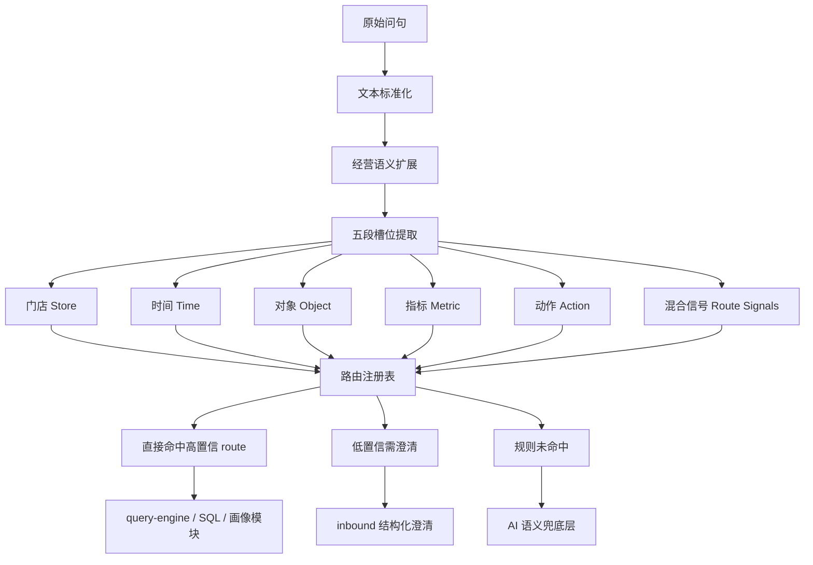
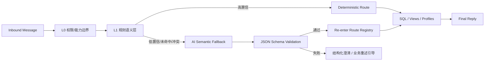

# Hetang Semantic Routing V2 Design

## Goal

把 `hetang-ops` 当前“能答已知问法，但复合问法容易误判”的语义层，升级成一套正式的五段语义模型，并先把 5 类高价值误判收口：

1. 生日名单 vs 跟进名单
2. 会员营销 vs 充值归因
3. 对比 vs 归因
4. 复盘 vs 建议
5. 总部全景 vs 单店诊断

本次设计同时给出下一步 `AI 语义兜底层` 的正式架构，但不把 AI 直接放进首条回复主链。

## Why

当前项目的主链已经不是“有没有数据”，而是“有没有稳定听懂问题”。

已有问题：

1. 规则问法命中快，但老板口语、复合问法、跨对象问法容易误判。
2. 一句话里同时出现多个对象或动作时，路由只能硬选一个主意图。
3. 错误通常不是“无数据”，而是“听错了问题”。
4. 继续只靠堆叠正则，会越来越重，维护成本持续上升。

## Current Main Chain

当前主链仍然坚持：

1. `inbound.ts` 做权限、能力边界、群聊接入、兜底提示
2. `query-semantics.ts` 做语义标准化与五段槽位提取
3. `query-route-registry.ts` 做注册式路由判定
4. `query-intent.ts` 做时间窗、门店范围和指标意图合成
5. `query-engine.ts` 做确定性 SQL / 物化视图 / 画像查询

本次不改变这个主链，只增强语义判定质量。

## Formal Semantic Model

### Five Slots

V2 正式语义对象：

```ts
type SemanticIntentV2 = {
  store: {
    scope: "single" | "multi" | "all" | "implicit";
    orgIds: string[];
    source: "explicit" | "binding-default" | "hq-scope" | "unknown";
  };
  time: {
    kind: "single" | "range" | "future_range";
    startBizDate: string;
    endBizDate: string;
    label: string;
    days: number;
    source: "explicit-date" | "relative-date" | "default";
  };
  object: "store" | "customer" | "tech" | "hq" | "recharge" | "wait_experience" | "unknown";
  secondaryObject?:
    | "store"
    | "customer"
    | "tech"
    | "hq"
    | "recharge"
    | "wait_experience"
    | "unknown";
  metric: {
    keys: string[];
    unsupportedKeys: string[];
    metricMode: "single" | "multi" | "composite" | "none";
  };
  action:
    | "metric"
    | "report"
    | "compare"
    | "ranking"
    | "trend"
    | "anomaly"
    | "risk"
    | "advice"
    | "followup"
    | "profile"
    | "portfolio"
    | "unknown";
  secondaryAction?:
    | "metric"
    | "report"
    | "compare"
    | "ranking"
    | "trend"
    | "anomaly"
    | "risk"
    | "advice"
    | "followup"
    | "profile"
    | "portfolio"
    | "unknown";
  routeSignals: {
    birthdayFollowupHybrid: boolean;
    rechargeCustomerHybrid: boolean;
    compareNeedsAttribution: boolean;
    reportAdviceHybrid: boolean;
    hqStoreMixedScope: boolean;
  };
};
```

### Interpretation Rules

1. `store` 决定回答范围，不决定业务对象。
2. `object` 决定下游模块：门店、顾客、技师、充值、等待体验、总部。
3. `action` 决定主回答形态：查数、复盘、比较、归因、建议、画像、名单。
4. `secondaryObject` / `secondaryAction` 不直接决定主 route，但用于冲突消解、澄清提示、AI 兜底。
5. `routeSignals` 只描述高价值混合语义，不直接渲染给用户。

## Landed V2 Changes

本次已落地到主链的增强：

1. `extensions/hetang-ops/src/query-semantics.ts`
   - 增加 `secondaryObject`
   - 增加 `secondaryAction`
   - 增加 `routeSignals`
   - 强化 `比前7天` 这类对比表达识别
   - 收紧 `hq_portfolio` 词面，避免单店 `先抓什么` 被误判成总部全景

2. `extensions/hetang-ops/src/query-route-registry.ts`
   - `recharge_attribution` 优先于 `member_marketing` 的混合归因问法
   - `anomaly` 优先于 `compare` 的“对比 + 为什么”问法
   - `report` 优先于 `advice` 的“复盘 + 先抓什么”问法
   - `hq_portfolio` 遇到“总部全景 + 单店诊断”混合问法时标记 `low confidence`

3. `extensions/hetang-ops/src/inbound.ts`
   - 对“总部全景 + 单店诊断”混合问法不再硬路由
   - 直接返回拆句建议，避免误投异步分析或错答

## High-Value Misclassification Fixes

| Case                 | Example                               | Old behavior                                | New behavior                                                                  |
| -------------------- | ------------------------------------- | ------------------------------------------- | ----------------------------------------------------------------------------- |
| 生日名单 vs 跟进名单 | `未来7天最值得先跟进的生日会员有哪些` | `birthday_members` 命中但不显式保留跟进语义 | 保留 `birthdayFollowupHybrid`，主 route 仍走 `birthday_members`，不丢跟进信号 |
| 会员营销 vs 充值归因 | `哪个客服带来的会员储值更高`          | 容易被 `member_marketing` 抢走              | 显式标记 `rechargeCustomerHybrid`，优先走 `recharge_attribution`              |
| 对比 vs 归因         | `义乌店近7天比前7天下滑为什么`        | `compare` 或直接掉空                        | 标记 `compareNeedsAttribution`，优先走 `anomaly`                              |
| 复盘 vs 建议         | `义乌店近7天经营怎么样，先抓什么`     | 容易只落到 `advice`                         | 标记 `reportAdviceHybrid`，主 route 改成 `report`，建议作为次动作             |
| 总部全景 vs 单店诊断 | `哪家店最危险，华美店具体哪里有问题`  | 容易硬进 `hq_portfolio` 甚至异步分析        | 标记 `hqStoreMixedScope`，入口直接提示拆句                                    |

## Routing V2 Diagram



## AI Semantic Fallback Layer

### Positioning

AI 只做 `语义补理解`，不做 `直接回答`。

主原则：

1. 已知高频问法继续走规则主链
2. 低置信度、未命中、复合新问法才触发 AI
3. AI 只输出受限结构化结果
4. 结构化结果必须经白名单校验后，才能再回到确定性路由和 SQL

### Architecture



### JSON Schema

AI 兜底层必须输出以下 JSON 结构：

```json
{
  "store_scope": "single",
  "store_names": ["华美店"],
  "time_type": "range",
  "time_label": "近7天",
  "time_start": "2026-04-01",
  "time_end": "2026-04-07",
  "object": "store",
  "secondary_object": "customer",
  "action": "report",
  "secondary_action": "advice",
  "metrics": ["serviceRevenue", "groupbuy7dStoredValueConversionRate"],
  "unsupported_metrics": [],
  "all_stores_requested": false,
  "needs_clarification": false,
  "clarification_reason": "",
  "confidence": 0.84
}
```

允许值约束：

- `store_scope`: `single | multi | all | implicit`
- `time_type`: `single | range | future_range | unknown`
- `object`: `store | customer | tech | hq | recharge | wait_experience | unknown`
- `secondary_object`: 同上，可为空
- `action`: `metric | report | compare | ranking | trend | anomaly | risk | advice | followup | profile | portfolio | unknown`
- `secondary_action`: 同上，可为空
- `metrics`: 仅允许系统支持的指标 key
- `unsupported_metrics`: 仅允许系统声明但未支持的 key
- `confidence`: `0.0 ~ 1.0`

### Trigger Conditions

AI fallback 只在以下情况触发：

1. 规则层完全未命中 route
2. `routeSignals` 表示混合冲突，且系统无法安全硬路由
3. 识别到明显经营问法，但缺失门店 / 时间 / 对象 / 动作中的关键槽位
4. 一句话里同时命中两个以上候选 route，且没有稳定优先级
5. 用户表达明显是老板口语，但规则层无法安全落库

### Confidence Thresholds

建议阈值：

1. `>= 0.85`
   - 直接接受 AI 结构化结果
   - 回到规则主链继续查询

2. `0.70 - 0.84`
   - 接受结构化结果，但只允许落到白名单 route
   - 若涉及混合范围或多 route 冲突，转结构化澄清

3. `0.55 - 0.69`
   - 不自动查询
   - 只用来生成“你是不是想问 A / B”式澄清建议

4. `< 0.55`
   - 直接丢弃
   - 回当前规则兜底话术

### Failure Fallback Strategy

AI fallback 的失败回退必须严格：

1. `模型超时`
   - 直接回业务重述引导
   - 不阻塞首条回复

2. `JSON 解析失败`
   - 当作 AI 失败
   - 不进入 query-engine

3. `字段不合法`
   - 丢弃该结果
   - 回结构化澄清

4. `指标 key 不在白名单`
   - 移除非法指标
   - 若无剩余可用指标，则转澄清

5. `门店范围或动作冲突`
   - 直接澄清
   - 不硬查询

## User-Facing Clarification Policy

以下情况优先给用户拆句建议，而不是瞎猜：

1. 总部全景 + 单店诊断混在一句
2. 两个时间窗但没有明确比较对象
3. 会员营销和充值归因同时出现，但问法没有明确主问题
4. 指标不支持，但同句还带策略词
5. 未来预测和历史复盘混在一起

澄清话术原则：

1. 直接指出混合点
2. 给出 2 条最推荐改问
3. 不讲技术概念
4. 不说“意图识别失败”

## Tests

本次需要长期保留的测试面：

1. `extensions/hetang-ops/src/query-semantics.test.ts`
2. `extensions/hetang-ops/src/query-route-registry.test.ts`
3. `extensions/hetang-ops/src/inbound.test.ts`

新增测试重点：

1. 混合语义信号是否被显式提取
2. 路由优先级是否符合经营语义
3. 低置信混合问法是否会转澄清而不是误答

## Non-Goals

本次不做：

1. 不把 AI 直接接进首条回复主链
2. 不让 AI 直接生成经营答案
3. 不把 `query-engine.ts` 改成开放式自然语言执行器
4. 不一次性重写所有旧问法规则

## Next Step

下一阶段按这个设计继续推进：

1. 把 `routeSignals` 和 `secondaryAction` 继续传到 `query-intent.ts`
2. 给 `resolveHetangNaturalLanguageRoute()` 增加低置信 route 元数据
3. 新增 `ai-semantic-fallback.ts`
4. 先只对白名单低置信问法启用 AI 兜底
