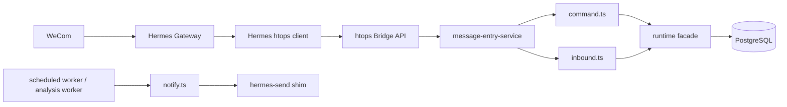

# Hetang Hermes Bridge Design

日期：2026-04-10
状态：approved
用途：定义 htops 从 OpenClaw 入口逐步迁移到 Hermes 的首期落地边界，先完成本地 bridge ingress 与稳定 outbound 契约，不打断现有 worker/query 能力。

---

## 1. 目标

首期目标不是一次性替换全部入口，而是先让 htops 提供一层稳定、可本地调用的 bridge API，供 Hermes 调用。

这期完成后：

- Hermes 可以通过本地 HTTP 调用 htops 的命令入口和自然语言入口
- htops 继续保留现有 `notify.ts` 出站契约
- 现有 `query-api`、`scheduled-worker`、`analysis-worker` 不受影响
- `runtime.ts` 不再新增外部入口职责

---

## 2. 分层边界



边界原则：

- Hermes 负责渠道接入、命令入口、线程上下文
- htops 负责权限、查询、分析、报表、数据 worker
- htops 业务层不 import Hermes 模块
- Hermes 不 import `htops/src/*`

---

## 3. 首期范围

### 3.1 Ingress

新增本地 bridge API：

- `GET /health`
- `GET /v1/capabilities`
- `POST /v1/messages/command`
- `POST /v1/messages/inbound`

传输约束：

- 仅监听 `127.0.0.1`
- 通过 `X-Htops-Bridge-Token` 做本地认证
- 所有接口挂在 `/v1`

### 3.2 App Entry Layer

新增 `src/app/message-entry-service.ts`：

- `handleCommandMessage()`
- `handleInboundMessage()`
- `describeCapabilities()`

这层负责把 bridge 请求适配到现有 `command.ts` / `inbound.ts`，不直接承载底层数据逻辑。

### 3.3 Outbound

继续以 `src/notify.ts` 作为唯一出站层。

首期不在 htops 内部引入 Hermes SDK；只要求 Hermes 提供与现有 `message send` 契约兼容的 `hermes-send` shim。

---

## 4. 请求契约

公共字段：

- `request_id`
- `channel`
- `account_id`
- `sender_id`
- `sender_name`
- `conversation_id`
- `thread_id`
- `is_group`
- `was_mentioned`
- `platform_message_id`
- `content`
- `received_at`

命令入口补充字段：

- `command_name`
- `args`
- `reply_target`

响应体：

```json
{
  "ok": true,
  "handled": true,
  "reply": {
    "mode": "immediate",
    "text": "..."
  },
  "job": null,
  "audit": {
    "entry": "command"
  }
}
```

说明：

- 首期以 `immediate` / `noop` 为主
- 对于分析类异步任务，首期仍先返回入队提示文本；后续再补标准化 `job` 字段

---

## 5. 去重与健壮性

bridge 层做轻量去重：

- 优先键：`request_id`
- 次键：`platform_message_id`
- 本地进程内 TTL cache

首期目标：

- 避免短时间重复投递导致重复回复
- 不引入新的数据库状态表

---

## 6. 运行进程

现有：

- `htops-query-api.service`
- `htops-scheduled-worker.service`
- `htops-analysis-worker.service`

新增：

- `htops-bridge.service`

这样做的收益：

- 渠道入口与 worker 解耦
- bridge 可独立重启
- 后续切掉 OpenClaw 时，不影响现有查询/分析/同步主链

---

## 7. 首期不做的事

- 不直接移除 OpenClaw adapter
- 不把自然语言入口重写成新语义层
- 不把 `runtime.ts` 做大规模重构
- 不在 htops 内引入 Hermes 内部依赖

---

## 8. 成功标准

- 本地 bridge 服务可启动并通过 token 保护
- command / inbound 两条路径都可通过 HTTP 调用
- 现有测试不回退
- 现有 worker 与 query API 启动方式不变
