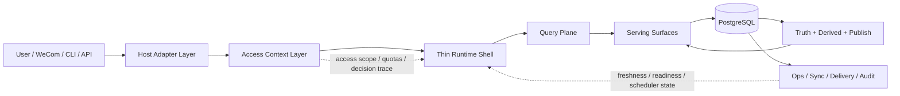

# Hetang Navly-Aligned Target Architecture Design

日期：2026-04-10
状态：proposed
用途：在不重构自杀的前提下，吸收 Navly 的核心优点，给 Hetang 项目定义一版更高上限、但仍适合当前业务阶段的目标架构与目录演进路径。

---

## 1. 结论先行

Hetang 当前不应该照搬 Navly，也不应该继续让 `runtime.ts + store.ts` 无限膨胀。

当前最优路线是：

1. 保留 `PostgreSQL` 作为唯一权威仓与 serving 主存储。
2. 保留当前 `QueryPlan + Capability Registry + SQL Compiler` 路线。
3. 学 Navly 的三件事：
   - 把访问控制提升为独立的 `access-context` 输出层
   - 把 runtime 压薄成真正的 interaction shell
   - 把 data truth / serving publish / readiness surface 的 owner boundary 正式化
4. 不学 Navly 的一点：
   - 不在当前阶段为“结构好看”而拆成多仓、多运行时、多协议层

一句话总结：

> Hetang 应该走“单仓实战型 + 双内核原则化”的架构，而不是直接变成 Navly。

---

## 2. 三种可选路线

### A. 保守演进

- 继续以现有 `src/runtime.ts`、`src/store.ts` 为中心
- 只做局部补丁式拆分
- 优点：改动小、见效快
- 缺点：技术债继续累积，半年后还会回到同一个问题

### B. Navly 化重构

- 对齐 Navly 的 kernel / contracts / bridge / runtime 分层
- 先拆 access kernel，再拆 data platform，再拆 thin runtime
- 优点：长期上限高
- 缺点：当前业务阶段成本过大，且会明显拖慢落地

### C. 推荐路线：渐进式内核化

- 保留 Hetang 现有单仓实战架构
- 但在代码边界上引入：
  - `access-context layer`
  - `serving query plane`
  - `runtime shell`
  - `delivery / scheduler / sync` 辅助面
- 优点：既保业务连续性，又能吸收 Navly 的正确架构原则

推荐：`C`

---

## 3. 目标架构蓝图



### 分层职责

#### 3.1 Host Adapter Layer

负责：

- 接入 WeCom / OpenClaw / CLI / HTTP API
- 统一请求入口格式
- 提取 actor、channel、requested scope、request metadata

不负责：

- 最终权限判定
- 事实查询
- SQL 生成

#### 3.2 Access Context Layer

负责：

- actor 解析
- role / org scope / channel scope 绑定
- 配额判定
- 输出统一 `access_context`
- 记录 access decision / audit trail

不负责：

- 业务指标解释
- SQL 编译
- 数据真相定义

#### 3.3 Thin Runtime Shell

负责：

- 把一次提问组织成标准执行链路
- 调 planner、capability registry、sql compiler
- 消费 access_context、serving_version、freshness/readiness
- 选择 answer / fallback / reject

不负责：

- 直接读大事实表
- 直接持有访问规则真相
- 直接成为调度中心和诊断大杂烩

#### 3.4 Query Plane

负责：

- `natural language -> intent -> QueryPlan`
- `QueryPlan -> Capability`
- `Capability + QueryPlan -> parameterized SQL`

约束：

- AI 不直接写 SQL
- SQL 只来自受控 capability family
- 白天查询主链只打 `serving_*`

#### 3.5 Data Platform

负责：

- raw audit
- truth facts
- daily snapshots
- incremental derived tables
- serving publish
- serving manifest
- readiness / freshness / coverage surfaces

---

## 4. Hetang 吸收 Navly 后的“理想边界”

### 4.1 应保留的 Hetang 优势

- 单 PostgreSQL 架构简单、稳定、符合当前规模
- `03:00-04:00` 批量 API 拉数模式天然适合 nightly publish
- `serving_*` 思路已经正确
- `QueryPlan + Capability Registry + SQL Compiler` 已经形成雏形

### 4.2 应吸收的 Navly 原则

- access truth 不能长期散落在命令入口和 runtime 分支里
- runtime 不能继续同时承担数据 facade、缓存、scheduler doctor、query executor
- serving 应该成为正式 owner surface，而不是“顺手做出来的一批 view”
- readiness / freshness / access decision 应有统一 machine-readable surface

### 4.3 当前不该做的事

- 不上 Pinot
- 不上双写 OLAP
- 不拆微服务
- 不引入复杂 workflow 编排框架
- 不为了“开放式 AI 提问”让 AI 直接生成生产 SQL

---

## 5. 目标目录拆分

以下不是一次性大迁移，而是目标形态。

```text
src/
  adapters/
    openclaw/
    cli/
    http/

  access/
    access-context.ts
    access-policy.ts
    access-audit.ts
    access-types.ts

  runtime/
    runtime-shell.ts
    runtime-answer.ts
    runtime-fallback.ts
    runtime-readiness.ts

  query-plane/
    query-intent.ts
    query-semantics.ts
    query-plan.ts
    capability-registry.ts
    sql-compiler.ts
    query-engine.ts

  data-platform/
    raw/
      raw-audit.ts
    truth/
      fact-store.ts
      snapshot-store.ts
    derived/
      mart-store.ts
      reactivation-store.ts
    serving/
      serving-publish.ts
      serving-manifest.ts
      serving-query-store.ts
      readiness-store.ts

  sync/
    sync-orchestrator.ts
    history-catchup.ts
    nightly-probe.ts

  delivery/
    notify.ts
    delivery-orchestrator.ts
    reactivation-push.ts

  ops/
    doctor.ts
    scheduler-status.ts
    queue-status.ts

  domain/
    customer/
    store/
    tech/
    hq/

  legacy/
    legacy-query-branches.ts
    compatibility.ts
```

---

## 6. 从当前代码到目标目录的映射

### 6.1 第一优先级：先拆 access

当前主要来源：

- `src/access.ts`
- `src/access-roster.ts`
- `src/access-import.ts`

目标去向：

- `src/access/access-context.ts`
- `src/access/access-policy.ts`
- `src/access/access-audit.ts`

原则：

- 先不追求 Navly 那种完整 kernel
- 先把“谁可以问什么、以什么 scope 问、命中什么 quota、最后输出什么 access_context”收成一层

### 6.2 第二优先级：压薄 runtime

当前主要来源：

- `src/runtime.ts`

目标去向：

- `src/runtime/runtime-shell.ts`
- `src/ops/doctor.ts`
- `src/data-platform/serving/serving-query-store.ts`

原则：

- runtime 只保留 interaction orchestration
- 诊断、缓存、查询执行代理、队列健康这些能力逐步外移

### 6.3 第三优先级：正式化 query plane

当前主要来源：

- `src/query-plan.ts`
- `src/capability-registry.ts`
- `src/sql-compiler.ts`
- `src/query-engine.ts`
- `src/query-semantics.ts`
- `src/query-intent.ts`

目标去向：

- `src/query-plane/*`

原则：

- 把这块从“新能力”提升成系统一级目录
- 因为这已经是未来开放式问题平台的核心资产

### 6.4 第四优先级：拆 store.ts

当前主要来源：

- `src/store.ts`

目标去向：

- `src/data-platform/truth/fact-store.ts`
- `src/data-platform/truth/snapshot-store.ts`
- `src/data-platform/derived/mart-store.ts`
- `src/data-platform/serving/serving-publish.ts`
- `src/data-platform/serving/serving-query-store.ts`
- `src/data-platform/serving/readiness-store.ts`

原则：

- 不是按表拆，而是按 owner responsibility 拆
- truth / derived / serving / readiness / publish 分开

---

## 7. 推荐迁移顺序

### Phase 1：边界立住

目标：

- access 从 command-level 判定升级成 access-context 输出
- query-plane 从“局部 feature”升级成正式主链
- runtime 明确只读 access + readiness + serving

### Phase 2：data owner 正式化

目标：

- 从 `store.ts` 中拆出 serving publish / manifest / readiness
- 把 nightly build、publish、freshness 标准化

### Phase 3：ops 与 delivery 分层

目标：

- `doctor()`、scheduler、queue、delivery 不再堆在 runtime
- 形成清晰运维面与消息投递面

### Phase 4：保留 legacy fallback

目标：

- 旧 handler 化问题先挂在 `legacy/`
- 新问题优先走 query-plane
- 逐步淘汰 runtime 中现算现拼分支

---

## 8. 是否适合未来“多门店、高并发、开放式新问题”

结论：适合。

前提是走上面的渐进式内核化路线，而不是继续所有能力都塞回 `runtime.ts`。

### 8.1 多门店

- 当前 10 店完全够用
- 500 店量级只要 serving 设计与索引正确，PostgreSQL 仍可支撑
- 真正关键不是换引擎，而是问答主链不扫事实表

### 8.2 高并发

- 你当前业务是夜间批、白天查
- 这天然适合 `serving table/view + cache + compiled query`
- 1000-3000 QPS 的方向上，先把 query-plane 收敛，比上新引擎更重要

### 8.3 开放式新问题

- 不能靠 AI 自由写 SQL
- 必须靠 `semantic understanding -> QueryPlan -> registered capability`
- 真正的新问题支持能力，核心在 capability family 扩展速度

---

## 9. 最终判断

Navly 比 Hetang 更像“长期平台骨架”。

Hetang 比 Navly 更像“已经能打业务的生产系统”。

最优解不是二选一，而是：

> 让 Hetang 保持 PostgreSQL 中心化实战架构，同时按 Navly 的原则逐步内核化。

如果未来继续推进，最值得优先落地的不是换技术栈，而是三件事：

1. `access-context layer`
2. `thin runtime shell`
3. `data-platform owner split`

这三件事情做完，Hetang 的架构质量会明显上一个台阶，但不会牺牲当前业务推进速度。
