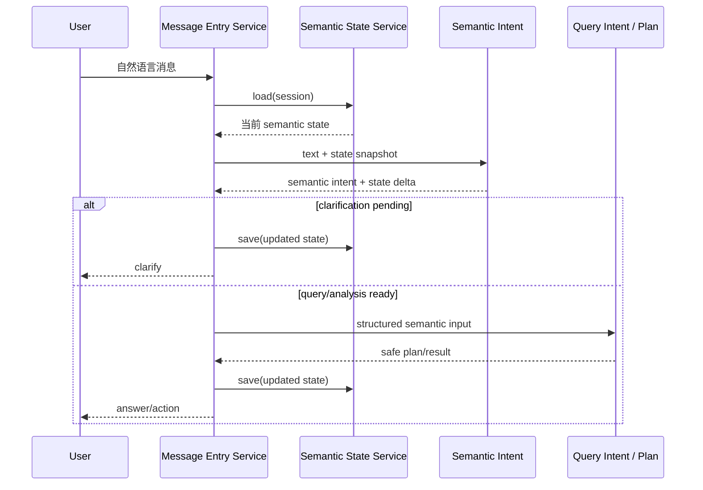

# Ontos-lite Semantic State Design

日期：2026-04-17  
状态：approved  
用途：为 `htops` 引入最小可落地的会话语义状态层，补齐多轮上下文、语义锚点、clarify 延续能力，同时不新增第二套业务真相源。

## 背景

当前 `htops` 在查询主链上已经形成了明确骨架：

`Text -> Semantic Intent -> Capability Graph -> Serving Semantic Layer -> Safe Execution -> Answer/Action`

但在多轮交互上仍有一个结构性缺口：

1. 当前目标、已确认条件、待补充条件大多仍是隐式状态
2. `clarify` 回复和下一轮用户补充之间缺少稳定的会话延续
3. 复杂口语问法容易在“规则命中失败”和“重新从零理解”之间抖动
4. AI fallback 缺少一个明确可写入、可继承、可审计的状态承载面

这会直接导致两个问题：

- 识别层明明“差一点能答”，但由于缺少会话状态，只能回到保守 clarify
- 后续引入更强的 AI semantic fallback 时，没有可控的上下文载体，容易绕过现有确定性主链

## 目标

1. 为单个会话建立显式 `semantic state`
2. 把当前目标、已确认 slots、待澄清 slots、最近路由结论收成结构化状态
3. 让下一轮补充问法可以在状态基础上继续解析，而不是总从零开始
4. 允许 AI semantic fallback 在受控边界内读写状态，但不直接执行系统动作
5. 保持 owner boundary 清晰，不把业务职责塞进 `runtime.ts`

## 非目标

1. 不引入完整 BDI 平台
2. 不新建一套独立 ontology runtime
3. 不让 semantic state 替代 capability graph
4. 不在本轮直接把 AI 升为第一层默认路由
5. 不修改 scheduler / sync / delivery 主链

## 方案选型

### 方案 A：纯内存会话状态

做法：

- 在 `message-entry-service` 进程内维护短 TTL map
- 仅为当前进程的多轮会话提供状态延续

优点：

- 实现最简单
- 不改数据库

缺点：

- 服务重启即丢状态
- 无法给 doctor / audit / 质量分析复用
- 多入口、多实例下不可靠

不推荐。只适合 demo，不适合生产控制面。

### 方案 B：最小 Postgres-backed semantic state

做法：

- 引入单独的会话语义状态 owner service
- 用 PostgreSQL 持久化状态和锚点
- `message-entry-service` 在进入语义识别前读取状态，在产生 clarify / query / analysis 结论后写回状态

优点：

- 状态可追踪、可审计、可恢复
- 与现有 PostgreSQL truth store 路线一致
- 能自然接入 doctor / quality loop

缺点：

- 需要新增最小 schema 和 store owner
- 多轮状态语义需要定义清楚

推荐本方案。

### 方案 C：完整 BDI / memory ontology 平台

做法：

- 把 Belief / Desire / Intention 做成独立运行时和 DSL
- 建立更复杂的本体层和 Agent 记忆层

优点：

- 语义表达最完整
- 长期扩展空间大

缺点：

- 超出当前项目真实需求
- 很容易引入平行真相源
- 与 repo 当前演进节奏不匹配

本轮不选。

## 推荐方案

选择 **方案 B：最小 Postgres-backed semantic state**。

核心原则：

1. `capability graph` 仍然是业务语义真相源
2. semantic state 只保存“当前会话上下文”和“待延续语义”
3. state 可以影响下一轮解析，但不能直接绕过 query plan 和 safe execution

## 架构设计

### 新增职责

建议新增 owner service：

- `src/app/conversation-semantic-state-service.ts`

建议新增持久化 owner：

- `src/store/conversation-semantic-state-store.ts`

建议接入点：

- `src/app/message-entry-service.ts`
- `src/semantic-intent.ts`
- `src/query-intent.ts`

### 职责边界

#### `conversation-semantic-state-service`

负责：

- 根据 `session_id + channel + sender` 解析当前会话状态
- 读取最近的 anchored slots
- 合并本轮语义解析结果
- 判断状态是否需要保留、刷新或清空

不负责：

- 直接做 query execution
- 直接做 capability 选择
- 直接做 AI 执行

#### `message-entry-service`

负责：

- 在语义识别前读取状态
- 在语义识别后把关键结论写回状态
- 在 clarify 场景下记录“缺什么”
- 在用户补充场景下尝试与上一轮 clarify 状态合并

不负责：

- 定义 state schema
- 直接操作底层 SQL

#### `query-intent` / `semantic-intent`

负责：

- 消费 `resolved semantic state snapshot`
- 在已有状态的基础上补齐 store/time/object/metric 等 slots
- 输出本轮解析结果和需要写回的状态变更提案

不负责：

- 直接持久化状态

## 数据模型

### 表 1：`conversation_semantic_state`

承载当前会话的最新状态快照。

```sql
create table conversation_semantic_state (
  session_id text primary key,
  channel text not null,
  sender_id text,
  conversation_id text,
  current_goal text,
  current_lane text,
  last_intent_kind text,
  clarification_pending boolean not null default false,
  clarification_reason text,
  anchored_slots jsonb not null default '{}'::jsonb,
  missing_slots jsonb not null default '[]'::jsonb,
  belief_state jsonb not null default '{}'::jsonb,
  desire_state jsonb not null default '{}'::jsonb,
  intention_state jsonb not null default '{}'::jsonb,
  last_route_snapshot jsonb,
  confidence numeric(5,4),
  version int not null default 1,
  updated_at timestamptz not null default now(),
  expires_at timestamptz
);
create index conversation_semantic_state_expiry_idx
  on conversation_semantic_state (expires_at);
```

### 表 2：`conversation_anchor_facts`

承载关键语义锚点历史。

```sql
create table conversation_anchor_facts (
  anchor_id bigserial primary key,
  session_id text not null,
  fact_type text not null,
  fact_key text not null,
  fact_value jsonb not null,
  source_turn_id text,
  source_kind text not null,
  anchor_weight int not null default 100,
  created_at timestamptz not null default now(),
  valid_until timestamptz
);
create index conversation_anchor_facts_lookup_idx
  on conversation_anchor_facts (session_id, fact_type, fact_key, created_at desc);
```

## 最小状态语义

为了避免概念膨胀，本轮只引入以下最小状态字段：

### Belief

回答“系统当前知道什么”：

- 当前门店 scope
- 当前时间范围
- 当前对象类型
- 当前指标集合
- 当前是否处于 clarify pending

### Desire

回答“用户现在想达成什么”：

- 是查询、分析、解释、复盘、澄清
- 目标对象是门店、顾客、技师还是总部

### Intention

回答“系统下一步准备做什么”：

- 等用户补店名
- 等用户补时间
- 直接查询
- 直接分析
- 拒绝 unsupported

这里的 BDI 只是内部状态语言，不单独做成新的系统抽象。

## 关键数据流



## 状态生命周期

### 1. 新会话

- 读取不到状态时创建空状态
- 不主动写库，直到本轮形成可保留语义

### 2. Clarify 场景

当系统识别出“缺时间”“缺门店”“缺对象范围”时：

- `clarification_pending = true`
- `clarification_reason` 写入标准化 kind
- `missing_slots` 写入待补字段
- 已知 slots 写入 `anchored_slots`

### 3. 用户补充场景

下一轮进入时：

- 优先合并上轮 `anchored_slots`
- 如果本轮文本只补充缺失 slot，则继承上轮 goal 和 lane
- 如果本轮文本明显切题，清理 pending clarify 状态，按新问题处理

### 4. 执行完成场景

- 成功 query / analysis 后更新 `last_intent_kind`
- 视内容保留部分 slots 供短时追问复用
- 对需要强隔离的问题可主动清空 `clarification_pending`

### 5. 过期

- 默认 TTL 建议 `15-30 分钟`
- 过期后只保留 anchor 历史，不再参与主路径解析

## 与 AI semantic fallback 的关系

AI semantic fallback 可以读 semantic state，也可以返回结构化的 `state delta`，但必须遵守以下约束：

1. AI 只能补语义，不能直接执行
2. AI 产出的结果必须回到 `semantic-intent -> query-plan -> safe execution`
3. AI 不能自己修改 capability graph
4. 所有 AI 产出的状态改动都必须进入 audit

## 风险与控制

### 风险 1：状态污染导致“上轮问题串到下轮”

控制：

- 只继承明确 anchored slots
- 用 TTL 控制状态寿命
- 对“明显换题”场景引入 reset 规则

### 风险 2：state 成为新的业务真相源

控制：

- 明确 state 只保存会话上下文，不定义业务能力
- capability graph 仍然是能力真相源

### 风险 3：写状态过多，性能和复杂度上升

控制：

- 只保存最小字段
- 不保存完整对话 transcript
- anchor facts 和 state snapshot 分层存储

## 验证策略

建议测试覆盖以下最小场景：

1. 上轮缺时间，本轮只回复“昨天”，能够继承原目标
2. 上轮缺门店，本轮只回复“义乌店”，能够继承原目标
3. 明显换题时，不继承旧 clarify 状态
4. AI fallback 产出的 state delta 能被安全合并
5. state 过期后不再影响下一轮路由

## 落地点

建议改动面：

- 新增：`src/app/conversation-semantic-state-service.ts`
- 新增：`src/store/conversation-semantic-state-store.ts`
- 修改：`src/app/message-entry-service.ts`
- 修改：`src/semantic-intent.ts`
- 修改：`src/query-intent.ts`
- 修改：相关类型与测试

## 决策

本设计采用：

- PostgreSQL 持久化最小 semantic state
- message-entry 作为主要接入点
- capability graph 继续作为业务语义真相源
- AI fallback 只做受控语义补全
