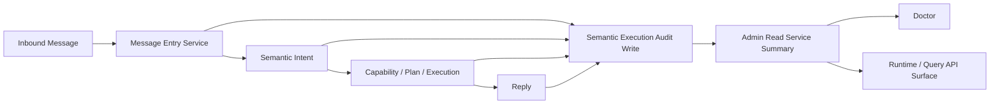

# Semantic Quality Loop Design

日期：2026-04-17  
状态：approved  
用途：为 `htops` 建立统一的语义执行质量闭环，让“识别失败”“clarify 过多”“AI fallback 是否有效”从现象变成可观测、可排序、可回放的问题。

## 背景

当前 `htops` 已经有多类质量线索：

- `route-compare` 日志和摘要
- `doctor` 输出
- `semantic-intent` 的 clarify / guidance / unsupported 分类
- 桥接层命令审计
- 运行时与测试中的局部回归覆盖

但这些信息仍然是分散的，导致两个问题：

1. 我们能看到“问题存在”，但不能稳定回答“最常失败的 Top 10 是什么”
2. 无法把规则路径、AI fallback、clarify 路径放在同一质量面上比较

如果未来要逐步把 AI 提升到更前的语义入口层，就必须先建立质量闭环，否则只会把不确定性前移。

## 目标

1. 统一记录一次语义执行从入口到结果的最小审计事件
2. 统一失败分类，让识别失败可排序、可聚合
3. 在 `doctor` 和管理读服务中暴露语义质量摘要
4. 为 AI fallback 接入提供可比的质量基线
5. 不引入外部分析平台，不新增 Redis

## 非目标

1. 不把所有日志都写入审计表
2. 不做 BI 仪表盘系统
3. 不在本轮做复杂离线标签平台
4. 不改变现有 query / analysis / report 的执行边界

## 方案选型

### 方案 A：继续依赖日志和 route-compare 汇总

做法：

- 维持当前日志方式
- 通过脚本汇总 doctor 和 route-compare

优点：

- 零 schema 成本
- 实现快

缺点：

- 缺乏结构化真相源
- 难以做稳定查询和趋势分析
- 无法很好关联 clarify、fallback、capability、失败分类

不推荐作为长期方案。

### 方案 B：最小结构化 quality loop

做法：

- 新增结构化 `semantic_execution_audits`
- 让 message entry / semantic intent / execution path 在关键节点写入一条最小审计事件
- `admin-read-service` 负责聚合近 24h / 7d 的质量摘要
- `doctor` 负责展示关键行

优点：

- 与当前 PostgreSQL 控制面一致
- 直接支持“失败 Top 10”“clarify rate”“AI fallback hit rate”等指标
- 后续能支撑评估是否该把 AI 前置

缺点：

- 需要明确定义 audit contract
- 需要补最小查询和聚合逻辑

推荐本方案。

### 方案 C：外部埋点 / 数据平台优先

做法：

- 把语义质量事件先送到外部分析系统

优点：

- 分析弹性大

缺点：

- 依赖外部系统
- 增加运维复杂度
- 当前项目不需要这么重

本轮不选。

## 推荐方案

选择 **方案 B：最小结构化 quality loop**。

原则：

1. 结构化审计优先于零散日志
2. 最小字段优先于“大而全埋点”
3. 质量层必须对齐当前 owner modules，而不是旁路它们

## 核心审计模型

### 表：`semantic_execution_audits`

```sql
create table semantic_execution_audits (
  audit_id bigserial primary key,
  occurred_at timestamptz not null default now(),
  session_id text,
  channel text,
  sender_id text,
  routing_mode text,
  raw_text text,
  effective_text text,
  lane text,
  intent_kind text,
  capability_id text,
  route_confidence text,
  clarification_needed boolean not null default false,
  clarification_reason text,
  fallback_used boolean not null default false,
  fallback_reason text,
  executed boolean not null default false,
  execution_target text,
  success boolean not null default false,
  failure_class text,
  latency_ms integer,
  semantic_slots jsonb,
  resolved_scope jsonb,
  route_snapshot jsonb,
  quality_labels jsonb
);
create index semantic_execution_audits_occurred_idx
  on semantic_execution_audits (occurred_at desc);
create index semantic_execution_audits_failure_idx
  on semantic_execution_audits (failure_class, occurred_at desc);
create index semantic_execution_audits_capability_idx
  on semantic_execution_audits (capability_id, occurred_at desc);
```

## 最小 failure taxonomy

建议先收敛到以下一级分类：

- `missing_store_scope`
- `missing_time_scope`
- `missing_object_scope`
- `missing_metric_scope`
- `mixed_scope`
- `unsupported_lookup`
- `generic_unmatched`
- `capability_gap`
- `execution_guard_blocked`
- `query_execution_failed`
- `analysis_execution_failed`
- `reply_guard_intervened`

设计原则：

- 一级分类尽量稳定
- 文本理由可以在二级字段里补充
- doctor 只展示一级分类 top counts

## 质量指标

### 核心指标

建议先聚合以下最小指标：

1. `recognized_count`
2. `unresolved_count`
3. `clarification_rate`
4. `fallback_used_rate`
5. `success_rate`
6. `route_capability_top`
7. `failure_class_top`
8. `p50_latency_ms`
9. `p95_latency_ms`

### 观察窗口

- 近 24 小时：适合 doctor
- 近 7 天：适合趋势判断和优先级排序

## 数据流



## 模块边界

### 建议新增 owner

- `src/app/semantic-quality-service.ts`
- `src/store/semantic-execution-audit-store.ts`

### 现有模块职责

#### `message-entry-service`

负责：

- 生成 audit skeleton
- 记录入口文本、routing mode、front-door decision

#### `semantic-intent`

负责：

- 输出 `intent_kind`
- 输出 `clarification_needed`
- 输出 `clarification_reason`
- 输出 `capability_id`

#### `query / analysis execution`

负责：

- 回填 `executed`
- 回填 `success`
- 回填 `failure_class`
- 回填 `latency_ms`

#### `admin-read-service`

负责：

- 聚合最近 24h / 7d 质量摘要
- 输出 top failure classes 和 top capabilities

#### `ops/doctor`

负责：

- 格式化质量摘要，不负责查询和聚合

## doctor 展示建议

建议新增 2 行左右的语义质量摘要，避免 doctor 过长。

示例：

```text
Semantic quality (24h): total 128 | success=78.1% | clarify=16.4% | fallback=9.4% | p50=182ms | p95=944ms
Semantic failures (24h): missing_time_scope:8, generic_unmatched:5, capability_gap:3
```

如果 7d 有明显波动，可再追加一行：

```text
Semantic trend (7d): top_capability=store.metric_trend | top_failure=missing_time_scope | unresolved=21
```

## 与 route-compare 的关系

`route-compare` 不应被废弃，而应成为质量层的一个子视角。

关系应为：

- `route-compare`: 对比 legacy / semantic 路由差异
- `semantic_execution_audits`: 记录真实线上语义执行结果

后者是统一真相源，前者是对比工具。

## 与 AI fallback 的关系

质量层必须明确区分：

- 纯规则命中
- 规则 + clarify
- AI fallback 命中
- AI fallback 仍 unresolved

只有这样，后续才能回答：

- 哪些问题值得继续走规则
- 哪些问题值得交给 AI
- AI 到底有没有在生产上提升成功率

## 风险与控制

### 风险 1：埋点过重，侵入主路径

控制：

- audit 事件保持最小字段
- 采用单条结构化写入
- 失败分类只保留稳定主类

### 风险 2：质量字段命名反复变化

控制：

- 提前冻结最小 contract
- 先满足 24h / 7d 聚合，不追求一步到位

### 风险 3：doctor 继续膨胀

控制：

- doctor 只展示聚合摘要
- 详细分析放在 admin-read-service 和后续查询面

## 验证策略

建议测试最小覆盖：

1. clarify_missing_time 能被写成结构化 failure class
2. AI fallback 命中会写 `fallback_used = true`
3. query 成功能写 `executed = true, success = true`
4. unresolved 样本能聚合进 top failure classes
5. doctor 能渲染最小质量摘要行

## 落地点

建议改动面：

- 新增：`src/app/semantic-quality-service.ts`
- 新增：`src/store/semantic-execution-audit-store.ts`
- 修改：`src/app/message-entry-service.ts`
- 修改：`src/semantic-intent.ts`
- 修改：`src/app/admin-read-service.ts`
- 修改：`src/ops/doctor.ts`
- 修改：相关类型和测试

## 决策

本设计采用：

- PostgreSQL-backed 最小结构化审计
- admin-read-service 聚合
- doctor 只展示摘要
- route-compare 保留为辅助对比视角
