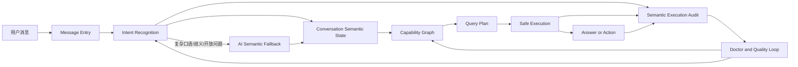

# Ontos For htops Review

## 背景

本文评审的是一类以 “Ontology / Ontos” 为核心的企业级 AI 架构思想，目标不是评价其术语包装，而是判断它对 `htops` 当前架构的真实适配度、可落地边界和最小吸收路径。

`htops` 当前的目标架构已经明确：

`Text -> Semantic Intent -> Capability Graph -> Serving Semantic Layer -> Safe Execution -> Answer/Action`

因此，本评审的核心问题不是“是否引入一套新的 Ontology OS”，而是：

1. 这套思想是否能补强 `htops` 现有的语义层、上下文层、质量层。
2. 哪些部分值得吸收，哪些部分会制造新的平行真相源。
3. 应该如何以最小改动演进，而不是重做系统。

## 业务洞察

`htops` 当前最核心的业务痛点，不是 AI 不够会聊天，而是系统还没有把“业务语义”“多轮上下文”“质量闭环”全部做成显式、可观测、可验证的控制面。

具体表现为：

- 查询理解仍以规则和显式模式为主，复杂口语、多步复合问法、跨域混问容易掉出主路径。
- 多轮对话里，当前目标、已确认条件、待补充条件还没有形成稳定的显式会话状态。
- AI 目前更像分析和兜底能力，而不是稳定的第一层语义解释器。
- 失败虽然能被观察到一部分，但还缺少统一的失败分类、质量量化和回放闭环。

从第一性原理看，`htops` 需要的不是“更大的 AI 抽象”，而是更清晰的三层能力：

- 业务语义真相源
- 多轮上下文状态机
- 质量与失败归因闭环

这恰好是 Ontos 思想里最值得吸收的部分。

## 当前状态

### 已有优势

`htops` 并不是从零开始。仓库中已经存在与 Ontos 思路高度兼容的骨架：

- 语义入口：[src/query-intent.ts](/root/htops/src/query-intent.ts)
- 计划层：[src/query-plan.ts](/root/htops/src/query-plan.ts)
- 能力图谱：[src/capability-graph.ts](/root/htops/src/capability-graph.ts)
- 安全执行层：[src/sql-compiler.ts](/root/htops/src/sql-compiler.ts), [src/query-engine.ts](/root/htops/src/query-engine.ts)
- 查询与消息入口：[src/app/message-entry-service.ts](/root/htops/src/app/message-entry-service.ts)
- 报表与调度主线：[src/app/reporting-service.ts](/root/htops/src/app/reporting-service.ts), [src/sync-orchestrator.ts](/root/htops/src/sync-orchestrator.ts), [src/schedule.ts](/root/htops/src/schedule.ts)
- 运维可观测面：[src/ops/doctor.ts](/root/htops/src/ops/doctor.ts)

这些模块已经构成一个“语义意图 -> 能力映射 -> 安全执行”的主链，这正是 `htops` 的护城河雏形。

### 当前短板

目前最明显的短板主要在三个层面：

1. `capability graph` 还更像查询能力骨架，没有完全升级成项目级业务语义目录。
2. 会话上下文与语义锚点仍偏隐式，很多能力还依赖规则命中或 prompt 临时理解。
3. 质量层已有 `doctor`、日志、测试，但缺少统一的语义执行审计面。

因此，`htops` 真正需要的是 Ontos-lite，而不是一套完整的新平台。

## Ontos 六层与 htops 的映射

| Ontos 层 | 含义 | 在 htops 中最接近的现有承载 | 判断 |
| --- | --- | --- | --- |
| L1 业务本体 | 实体、属性、概念 | `capability-graph`, `query-intent`, 各类指标查询模块 | 已有雏形 |
| L2 关系本体 | 实体间关系 | capability 依赖、门店/时间/指标关系 | 需要显式化 |
| L3 流程本体 | 业务动作、事件、顺序 | `sync-orchestrator`, `schedule`, `reporting-service` | 已较强 |
| L4 上下文本体 | 当前交互上下文 | `message-entry-service`, 意图澄清逻辑 | 明显偏弱 |
| L5 记忆本体 | 多轮记忆、目标延续 | 会话 slot、clarify、用户当前目标 | 需要补强 |
| L6 质量本体 | KPI、失败归因、质量优化 | `doctor`, route compare, 测试与日志 | 已有基础，未统一 |

结论是：

- `htops` 已经有 L1-L3 的主要骨架。
- 真正缺的是 L4-L6 的显式化和工程化。

## 架构方案与权衡

### 方案 A：完整引入 Ontos 平台

做法：

- 单独设计 L1-L6 的统一 ontology schema
- 将查询、分析、调度、报告全部迁移到新的本体驱动层
- 引入更完整的 BDI、记忆层、质量层、流程层

优点：

- 理论上语义一致性最强
- 更适合跨业务线扩展
- 更适合未来复杂 Agent 编排

缺点：

- 建模成本高
- 会与当前 `capability graph + query plan + safe execution` 形成双轨真相源
- 容易把生产问题推迟成“平台建设”
- 与当前 repo 规则不一致，风险大

适用场景：

- 多业务线统一语义平台
- 企业级知识操作系统
- 已经具备稳定 eval、memory、control plane 基础设施

### 方案 B：按 Ontos-lite 演进现有架构

做法：

- 将 `capability graph` 作为 L1-L3 的核心语义骨架
- 补一层显式会话状态和语义锚点，承担 L4-L5
- 用 `doctor + telemetry + execution audit` 承担 L6
- AI 继续做受控语义补全，不绕过确定性控制面

优点：

- 最小改动
- 与现有 owner modules 对齐
- 不会新增第二套真相源
- 能直接改善当前识别失败和上下文缺失问题

缺点：

- “平台化”观感没有方案 A 强
- 需要克制演进，避免变成散点优化

### 推荐方案

推荐 **方案 B：Ontos-lite**。

理由：

1. `htops` 当前的主要矛盾是识别失败、上下文缺失、质量不可归因，不是平台抽象不够大。
2. 现有 `capability graph` 已经是最重要的语义资产，应该升级它，而不是旁路它。
3. 项目规则明确要求：
   - 不扩 `runtime.ts`
   - 强化 owner modules
   - AI 不绕过 deterministic control surface
4. 对 `htops` 而言，真正的护城河不是术语，而是“业务语义 + 安全执行 + 质量闭环”。

## 核心技术判断

### 哪些 Ontos 思想值得吸收

#### 1. 统一业务语义真相源

这一点最值得吸收。

当前项目中，最适合作为统一语义真相源的不是新建 ontology 平台，而是继续强化 [src/capability-graph.ts](/root/htops/src/capability-graph.ts) 及其相关计划层，使之从“查询能力注册表”升级为“项目级业务语义目录”。

#### 2. 显式上下文与语义锚点

这也是高价值能力。

类似 Ontos 中的 semantic compression、anchoring、memory ontology，对 `htops` 的真实落点不是做复杂对话记忆系统，而是：

- 当前用户目标显式化
- 已确认 slot 显式化
- 待澄清 slot 显式化
- 多轮会话里的关键锚点可追踪

#### 3. 质量本体

这部分对 `htops` 非常重要。

当前系统已经有 `doctor`、日志、route compare、测试，但还需要一个统一的语义质量层，能回答：

- 哪类问题最容易识别失败
- 是规则没命中、缺 slot、能力图谱缺失、还是执行失败
- 哪些问题适合继续走规则
- 哪些问题已经值得交给 AI semantic fallback

### 哪些 Ontos 思想不该直接照搬

#### 1. 完整 BDI 平台化

BDI 可以作为设计语言理解，不建议现在做成一套独立运行时。

在 `htops` 里，Belief / Desire / Intention 更适合被实现为轻量会话状态字段，而不是新建一套 Agent 心智平台。

#### 2. 六层全部实体化

如果现在把 L1-L6 全部落成独立 schema、独立服务、独立 DSL，会立刻引入新的复杂度，并与现有控制面重叠。

#### 3. 用本体替代 capability graph

这是最大误区。

对 `htops` 而言，正确路径是：

- capability graph 吸收 Ontos 思想
- 而不是 Ontos 平台取代 capability graph

## 建议的数据模型

以下是推荐的最小数据模型，不代表必须立即建表，而是给后续演进提供明确形状。

### 1. 语义能力目录

逻辑表：`semantic_capabilities`

用途：

- 显式承载 capability、所需 slots、目标实体、执行模式、安全策略、质量策略
- 将能力图谱从纯代码结构推进到代码 + 数据双可见的控制面

```sql
create table semantic_capabilities (
  capability_id text primary key,
  domain text not null,
  intent_type text not null,
  target_entity text not null,
  metric_set jsonb not null,
  required_slots jsonb not null,
  optional_slots jsonb not null,
  execution_mode text not null,
  safety_policy jsonb not null,
  quality_policy_id text,
  version text not null,
  is_active boolean not null default true,
  created_at timestamptz not null default now(),
  updated_at timestamptz not null default now()
);
```

### 2. 会话语义状态

逻辑表：`conversation_semantic_state`

用途：

- 显式承载当前目标、已知条件、当前意图、会话置信度
- 这是 L4/L5 的最小落点

```sql
create table conversation_semantic_state (
  session_id text primary key,
  user_id text,
  channel text not null,
  current_goal text,
  anchored_slots jsonb not null default '{}'::jsonb,
  belief_state jsonb not null default '{}'::jsonb,
  desire_state jsonb not null default '{}'::jsonb,
  intention_state jsonb not null default '{}'::jsonb,
  last_intent_type text,
  confidence numeric(5,4),
  updated_at timestamptz not null default now(),
  expires_at timestamptz
);
```

### 3. 语义锚点事实

逻辑表：`conversation_anchor_facts`

用途：

- 显式记录关键门店、时间范围、比较对象、业务目标等语义锚点
- 对应 “anchoring mechanism” 的最小工程实现

```sql
create table conversation_anchor_facts (
  anchor_id bigserial primary key,
  session_id text not null,
  fact_type text not null,
  fact_key text not null,
  fact_value jsonb not null,
  source_turn_id text,
  source_kind text not null,
  anchor_weight int not null default 100,
  valid_from timestamptz not null default now(),
  valid_to timestamptz,
  created_at timestamptz not null default now()
);
```

### 4. 语义执行审计

逻辑表：`semantic_execution_audits`

用途：

- 统一记录每次语义识别、clarify、执行、失败分类、时延与结果质量
- 是 L6 质量层的核心支撑

```sql
create table semantic_execution_audits (
  audit_id bigserial primary key,
  session_id text,
  turn_id text,
  capability_id text,
  route_kind text not null,
  recognized boolean not null,
  clarified boolean not null,
  executed boolean not null,
  success boolean not null,
  failure_class text,
  latency_ms int,
  input_slots jsonb,
  resolved_slots jsonb,
  output_quality jsonb,
  created_at timestamptz not null default now()
);
```

## 系统边界建议

### 应保留的 owner boundaries

- [src/query-intent.ts](/root/htops/src/query-intent.ts)
  - 负责意图识别、slot 解析、clarify 触发、AI fallback 接入点
- [src/query-plan.ts](/root/htops/src/query-plan.ts)
  - 负责把语义请求转为结构化计划
- [src/capability-graph.ts](/root/htops/src/capability-graph.ts)
  - 负责业务语义目录与能力边界
- [src/query-engine.ts](/root/htops/src/query-engine.ts)
  - 负责安全执行与返回
- [src/app/message-entry-service.ts](/root/htops/src/app/message-entry-service.ts)
  - 适合承接轻量会话状态与上下文协调
- [src/ops/doctor.ts](/root/htops/src/ops/doctor.ts)
  - 负责质量面、控制面、可观测面的展示

### 明确不建议的边界漂移

- 不把新的语义记忆职责塞进 [src/runtime.ts](/root/htops/src/runtime.ts)
- 不在 `store.ts` 里顺手长出完整的语义控制面 owner
- 不让 AI sidecar 绕过 `capability graph -> query plan -> safe execution`

## AI 在 Ontos-lite 中的角色

AI 在 `htops` 里不应是自由执行者，而应是受约束的语义补全器和分析器。

推荐角色：

- 复杂口语意图补全
- 歧义消解建议
- 开放式问题的结构化分析
- 多轮语义状态补全
- 质量回放与失败归因辅助

不推荐角色：

- 直接拼 SQL
- 直接执行控制命令
- 绕过 capability graph 决定系统行为
- 替代 deterministic control plane

## 按数据流的目标形态



## 实施建议

### Phase 1：先做 Ontos-lite 最小闭环

目标：

- 不重做主架构
- 不引入第二套 ontology 平台
- 先把语义、上下文、质量三个缺口补成显式控制面

优先动作：

1. 强化 capability graph 的业务语义描述能力
2. 引入会话语义状态
3. 引入语义锚点
4. 补统一 execution audit

### Phase 2：把 AI 提升为受控第一层补充能力

前提：

- 已经有能力目录
- 已经有失败分类
- 已经知道哪些问题规则最容易失败

动作：

1. 为特定问题类型接入 AI semantic fallback
2. AI 只产出结构化语义帧，不直接执行
3. 用 execution audit 对比规则路径和 AI 路径

### Phase 3：形成质量闭环

目标：

- 清楚知道 Top 失败类型
- 清楚知道修复优先级
- 清楚知道 AI 是否真正提升了成功率

动作：

1. 统一 failure taxonomy
2. doctor 增加 semantic quality 面
3. 将 route compare、clarify、success rate、fallback hit rate 汇总

## 最终结论

“Ontos” 对 `htops` 最有价值的，不是一套完整六层本体平台，而是一种提醒：

- 业务语义要成为真相源
- 多轮上下文要成为显式状态
- 质量与失败要形成闭环

因此，`htops` 的正确选择不是“引入 Ontology OS”，而是：

**把 Ontos 思想吸收为 capability graph + conversation semantic state + semantic execution audit 的受控演进路径。**

这条路径既符合当前代码结构，也符合项目规则，还能直接改善真实生产问题。

## 建议的后续文档

如果后续确认要推进 Ontos-lite，建议新增两份文档：

1. `docs/plans/2026-04-17-ontos-lite-semantic-state-design.md`
2. `docs/plans/2026-04-17-semantic-quality-loop-design.md`

前者聚焦 L4/L5，后者聚焦 L6。
